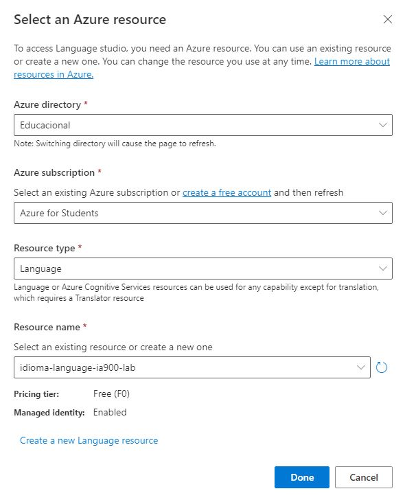

# Análise de Sentimentos com Language Studio no Azure AI

## Introdução

Neste laboratório foi realizados testes de sentimentos em textos através do portal Speech da Microsoft.

## Início do projeto

Acessei o site [https://speech.microsoft.com/portal](https://speech.microsoft.com/portal)

Cliquei em configurações e criei um recurso.

Após a criação, selecionei o recurso e cliquei em usar recurso.

Voltei para a página do speech e em *conversão de fala em texto*, cliquei em *conversão de fala em texto em tempo real*.

Realizei os testes de fala em tempo real.

## Language Studio

No portal do Azure cliquei em criar recurso - AI + Machine Learning - Análise de Texto, direciou para outra página, e cliquei em **Continuar para criar o recurso**.
Preenchi os dados, fiz a criação e aguardei a implantação do recurso.

Após a conclusão, acessei o link [https://language.cognitive.azure.com/home](https://language.cognitive.azure.com/home) e preenchi as informações.

Voltei para a página principal e cliquei nos seguinte links

Fui direcionada para a página para inserir as informações. Inseri um texto em português de uma avaliação de um hotel.

Cliquei que aceito em *I acknowledge that runnin this demo will incur usage and may incur costs to my Azure resource* e rodei o teste. 

O resultado da primeira sentença:

Texto Original

## Conclusão

A análise de sentimento com Language Studio no Azure AI nos ajuda a descobrir o que as pessoas acham de sua marca ou tópico através da mineração de um texto para obter pistas sobre sentimentos positivos ou negativos e podem associá-los a aspectos específicos do texto. 

**OBS: O recurso foi removido após a conclusão do laboratório**
